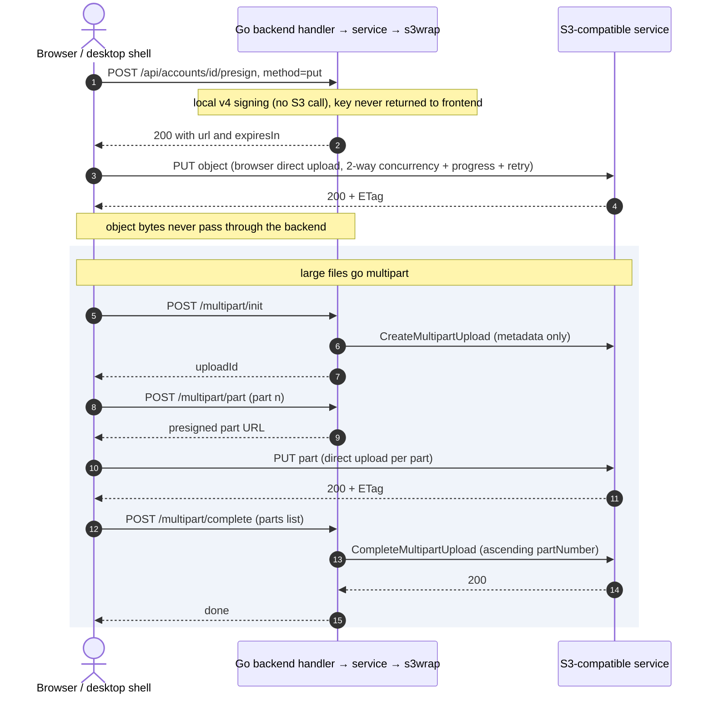

# Architecture

> **Source (Chinese SSOT)**: [`docs/architecture.md`](../architecture.md) — Chinese is the single source of
> truth (SSOT); this English page is a translation snapshot and may lag behind the original. If the two
> disagree, the Chinese original wins.
> **Source revision**: `30599f0` (2026-10-10), synchronized from the working tree on 2026-10-10.

> This document describes the overall architecture of s3client and its key design decisions. Architecture
> Decision Records (ADRs) live in [`docs/decisions/`](../decisions/index.md).

## 1. Overall architecture

s3client uses a **B/S (Browser/Server) architecture + Tauri 2 desktop shell (no IPC)**:

```
┌─────────────────────────────┐
│  Web (browser)              │
│  Tauri 2 shell (B/S, no IPC)│
└──────────────┬──────────────┘
               │ HTTP (REST /api, optional Bearer)
┌──────────────▼──────────────┐
│  Go backend (B/S server)    │
│  · account config storage   │
│  · S3 SDK v2 wrapper        │
│  · v4 presigned URL issuing │
└──────┬───────────┬─────────┘
       │           │ direct upload
       │           ▼ (presigned v4 URL, PUT straight to S3)
       │      ┌─────────────┐
       └────▶ │ S3-compatible│
              │ service      │
              └─────────────┘
```

### Core design decisions

1. **Direct upload**: once the backend has issued a v4 signed URL, the browser uploads/downloads S3
   **directly**; heavy traffic does not pass through the Go service. Keys are never returned to the frontend.
2. **No IPC on desktop**: Tauri 2 is only a shell; frontend and backend all go over HTTP, minimizing the
   attack surface (see [ADR-001](../decisions/0001-desktop-no-ipc.md)).
3. **REST API as the only entry point**: Web and desktop share the same `/api/*`; the OpenAPI 3.0.3 contract
   is auto-generated (`/api/openapi.json`).

## 2. Backend layering

```
apps/web/src (Vue 3)
   │  HTTP + JSON
   ▼
apps/server/internal/handler     HTTP layer: routing, parameter validation, error mapping, DTO conversion, OpenAPI registration
   ├────────► apps/server/internal/service   orchestration: batch / delete / migrate / async jobs / zip / schedules
   │              └────────► apps/server/internal/s3wrap   AWS SDK v2 wrapper + SSRF protection + presigning (anti-corruption layer)
   ├────────► apps/server/internal/s3wrap    (signing / error mapping used directly, without going through service)
   ├────────► apps/server/internal/store     account store (json / sqlite / encrypted, single entry point store.Open)
   ├────────► apps/server/internal/openapi   contract registry (runtime source of GET /api/openapi.json)
   └────────► config / tracing / atomicfile  configuration, tracing and atomic write (leaf dependencies)

apps/server/internal/store · s3wrap · service ──► apps/server/internal/model   domain model (Account / AccountView)
apps/server/internal/store · service · handler ──► apps/server/internal/atomicfile   atomic-write leaf package
```

- **Dependency direction (real import edges, verified 2026-10-10)**: `handler → {service, s3wrap, store, openapi,
  config, tracing, atomicfile}`, `service → {s3wrap, model, atomicfile}`, `{store, s3wrap} → model`,
  `store → atomicfile`; no reverse dependencies, no cycles. The commonly quoted chain
  "`store → model → s3wrap → handler`" is a **stack-order shorthand** — `s3wrap` does **not** depend on `store`
  (only on `model`), while `handler` depends on `store` **directly** (account reads/writes bypass service).
- **Anti-corruption layer**: `s3wrap` is the only boundary between AWS types and the outside world; AWS types
  never leak into handler/frontend.
- **Single entry point**: `store.Open(dataDir, driver, key)` opens the store by driver.

### Key mechanisms

| Mechanism | Location | Notes |
|---|---|---|
| Error mapping | `s3wrap/errors.go` | S3 error → stable HTTP status + short English user message (sentinel + `errors.Is`) |
| SSRF protection | `s3wrap/ssrf.go` | Double validation at creation + dial time (blocks IMDS/link-local, redirects, proxies); `S3C_SSRF_DENY_PRIVATE=1` also rejects private/loopback; rationale in [ADR-003](../decisions/0003-ssrf-private-allow.md) |
| Presigning | signing in `s3wrap/presign.go`; default & clamp in `handler/objects.go` (`presign`) and `handler/multipart.go` (`multipartPart`) | v4 signed URL; `expiresIn` ≤ 0 takes the default **1h**, > 24h is clamped to **24h** (the S3 protocol ceiling is 7 days; the console deliberately tightens it), **no 1h floor**; rationale in [ADR-007](../decisions/0007-presign-direct-upload.md) |
| Atomic write | `internal/atomicfile/atomicfile.go` (call sites `store/filestore.go`, `service/job_persist.go`) | temp file + rename + 0600; on write failure the in-memory state rolls back; rationale in [ADR-006](../decisions/0006-store-drivers-atomic-write.md) |
| Single-writer lock | `store/lock.go` | `flock` on `DataDir` (`.s3client.lock`); a second instance fails to start; no-op on non-unix; rationale in [ADR-006](../decisions/0006-store-drivers-atomic-write.md) / [ADR-011](../decisions/0011-single-instance-no-ha.md) |
| Job-list persistence | `service/job_persist.go` | same atomic-write strategy, but kept self-contained in the `service` package: `service→store` would invert the layering; rationale in [ADR-005](../decisions/0005-sse-async-jobs.md) |
| Streaming concurrency limit | `handler/stream.go` | global cap of 32 concurrent streams + rolling 5min idle write timeout; rationale in [ADR-009](../decisions/0009-bounded-concurrency.md) |
| Bounded batch concurrency | `service/batch.go` | `RunBatch` uses an unbuffered result channel, memory O(workers); rationale in [ADR-009](../decisions/0009-bounded-concurrency.md) |
| Async jobs | `service/job.go` + `job_persist.go` | JobRegistry + SSE progress + TTL reap; the job list can optionally be persisted (`JobPersister`); on startup non-terminal jobs are marked `interrupted` and reconciled; rationale in [ADR-005](../decisions/0005-sse-async-jobs.md) |
| OTel tracing | `internal/tracing/` | minimal tracer with zero third-party deps: W3C `traceparent` parse/generate + OTLP/HTTP JSON export (bounded queue + background batching, failures are log-only); `S3C_OTEL_ENDPOINT` empty by default = disabled; rationale in [ADR-013](../decisions/0013-zero-dep-otlp-tracing.md) |

## 3. Frontend architecture

```
apps/web/src/
  api/               API client (module directory split by responsibility, see below)
    storage.ts         browser credentials / multi-server profile storage (bottom of the dependency graph)
    http.ts            transport layer: base + Bearer + JSON + error normalization
    endpoints.ts       domain endpoint wrappers (the `s3api` object, 72 methods; not the same unit as the backend's 84 `/api/*` endpoints)
    jobs.ts            async-job SSE subscription + post-EOF status re-read fallback
    download.ts        ZIP streaming to disk (File System Access API + blob fallback)
    upload.ts          presigned direct upload (XHR, provides upload progress)
    index.ts           public-surface barrel: assembles the `api` object and re-exports
  store.ts           global state (accounts / tabs / toasts)
  types.ts           type definitions aligned with the backend contract
  components/        panel and dialog components
  composables/       reusable logic (object browsing/actions/upload/preview/shortcuts)
  i18n/messages/     zh/en message dictionaries split by domain
  router.ts          hash deep links (no vue-router dependency)
```

> `api/` used to be a single file `api.ts` (838 lines, mixing credential storage, transport, domain
> endpoints, SSE and upload in one place). After the split into a directory, `./api` / `../api` still
> resolve to `api/index.ts`, so the **external contract and import paths are unchanged**; modules depend
> one way: `index → {endpoints, jobs, download, upload} → http → storage`, with no cycles. The public
> surface is guarded by `src/deadcode_gate.test.ts` (API public surface + non-API module exports / orphan
> modules): exports with zero production references and source modules nobody imports turn the gate red.

- **Tech stack**: Vue 3 + Vite + TS; the only production dependency is **`vue`** (deliberately minimal supply chain).
- **Race protection**: `loadSeq` + `AbortController` as a double safeguard; every SSE subscription is torn down on the unmount path.
- **Preview safety**: all previews go through the server-side proxy (three modes + type allowlist + sandbox); zero `v-html` in the frontend.

## 4. Desktop

- Tauri 2, a pure B/S shell, with no IPC and no commands (see [ADR-001](../decisions/0001-desktop-no-ipc.md)).
- Minimal permissions: `withGlobalTauri` disabled + capability trimmed (empty permission set).
- Distribution: CI cross-builds `.exe` (NSIS) / `.deb` / `.dmg`, attaches them to the GitHub Release with SHA256SUMS.

## 5. Data-flow example: object upload

1. Frontend `POST /api/accounts/{id}/presign` (method=put) → backend `PresignPut` generates a v4 signed PUT URL.
2. The frontend PUTs straight to S3 with **XHR** (`api/upload.ts`; only `XMLHttpRequest` provides upload
   progress events), 2-way concurrency + progress + retry.
3. ≥ 100 MB goes multipart: `/multipart/init` → `/multipart/part` (per-part presigning) → `/multipart/complete`.
4. The backend never touches object bytes; it only issues signatures.

The same flow as a sequence diagram (GitHub renders `mermaid` natively; the text above and this diagram
must stay in sync):



## 6. Configuration system

All configuration is injected through environment variables (`S3C_*`), with `.env` support (lookup order:
`S3C_ENV_FILE` → CWD → directory of the executable; real environment variables win; **an unreadable explicit
`S3C_ENV_FILE` refuses startup** instead of silently falling back to defaults). The full matrix is in
[`CONFIGURATION.md`](../CONFIGURATION.md) (**SSOT**).

## 7. Key trade-offs (see the ADRs)

| Decision | Rationale |
|---|---|
| Fail hard instead of degrading when storage is unavailable | A read-only degraded mode would silently lose writes ([ADR-002](../decisions/0002-store-fail-closed.md)) |
| SSRF allows private/loopback addresses | Self-hosting (MinIO/RustFS/LAN) is the main scenario ([ADR-003](../decisions/0003-ssrf-private-allow.md)); `S3C_SSRF_DENY_PRIVATE=1` switches to rejecting private networks |
| No IPC on desktop | Minimize the attack surface ([ADR-001](../decisions/0001-desktop-no-ipc.md)) |
| Frontend production dependency is vue only | Minimize the supply chain ([ADR-004](../decisions/0004-minimal-frontend-deps.md)) |
| Async jobs all go through the server-side JobRegistry + SSE progress push | Long tasks are contained server-side; single source of progress truth, reconcilable after restart ([ADR-005](../decisions/0005-sse-async-jobs.md)) |
| Three account-store drivers (json / sqlite / encrypted) + atomic write + single-writer lock | The storage implementation layer carries ADR-002's "fail hard" decision ([ADR-006](../decisions/0006-store-drivers-atomic-write.md)) |
| Browser presigned direct upload; object bytes never pass through this service | Heavy traffic bypasses the Go service; keys are never returned to the frontend ([ADR-007](../decisions/0007-presign-direct-upload.md)) |
| Self-built router / state / i18n / HTTP under zero frontend runtime dependencies | The companion trade-off to ADR-004 ([ADR-008](../decisions/0008-frontend-zero-dep-stack.md)) |
| All batch and streaming requests use bounded concurrency | Memory O(workers); overload returns an explicit 503 instead of dragging the process down ([ADR-009](../decisions/0009-bounded-concurrency.md)) |
| Server-side streaming ZIP packaging | Nothing lands on the server disk; bounded memory ([ADR-010](../decisions/0010-zip-streaming.md)) |
| Single-instance deployment, no HA | File-based storage + in-memory job table + single token; multiple replicas need external state and leader election ([ADR-011](../decisions/0011-single-instance-no-ha.md)) |
| REST contract without a version prefix | Breaking changes are buffered by release cadence ([ADR-012](../decisions/0012-rest-no-version-prefix.md)) |
| Self-built OTel tracing with zero third-party deps, disabled by default | Minimize the dependency budget and supply chain (standard library only, direct OTLP/HTTP JSON); enabled only when `S3C_OTEL_ENDPOINT` is non-empty ([ADR-013](../decisions/0013-zero-dep-otlp-tracing.md)) |
