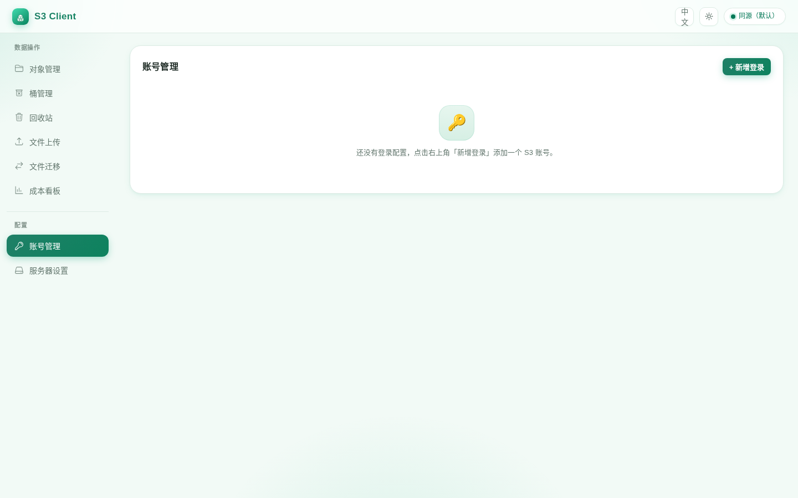
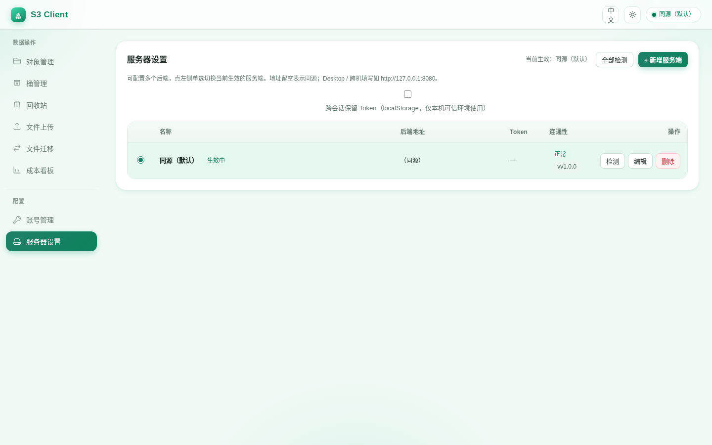

# S3 Client (s3client)

> **English | 中文**：本页是根 [`README.md`](../../README.md) 的**英文翻译快照**。
> **中文 README 是单一事实来源（SSOT）**——本页只翻译现有事实，数字与命令与中文版逐字一致；
> 若两者出现冲突，**以中文 README 为准**（本页由链接门禁保证链接不悬空，但保证不了内容同步）。

S3-compatible object storage client built on **AWS Signature V4**. Ships a **Web UI** and a
**Tauri 2 desktop app**; the desktop app uses a **B/S architecture** with **no Tauri IPC** —
frontend and backend talk exclusively over HTTP.

Versioning: after the stable **v1.0.0** milestone, everyday releases use a **timestamp**
(`v1.0.0-YYYYMMDDHHmmss`); prereleases may use **`v1.0.0-rcN`**. Current version: `v1.0.0` —
see [Changelog](../../CHANGELOG.md).

> [!TIP]
> - The backend binds `127.0.0.1` by default (safer), with a CORS allowlist and optional Bearer auth.
> - Direct upload: the browser gets a v4 presigned URL and PUTs **straight** to S3, bypassing this service.

## Screenshots

| Fresh install (account management empty state) | Server settings |
|---|---|
|  |  |

> Screenshots are rendered from the **real build output** by
> [`apps/web/e2e/screenshots.spec.ts`](../../apps/web/e2e/screenshots.spec.ts) — that spec doubles as a
> smoke test (asserts the UI renders without "cannot connect to backend" noise).
> Regenerate: `cd apps/web && pnpm build && pnpm exec playwright test screenshots.spec.ts`.

## Features

- **Accounts**: CRUD, connectivity test (`HeadBucket`), list buckets (`ListBuckets`). Vendors are grouped
  as S3-compatible / domestic Chinese / international: MinIO and other S3-compatible services; domestic
  (Aliyun OSS, Tencent COS, Huawei OBS, Volcano TOS, Baidu BOS, JD Cloud, Qiniu); international (AWS,
  Cloudflare R2, Wasabi, Backblaze B2, DigitalOcean Spaces, Linode/Akamai, Scaleway, Hetzner).
- **Browse objects**: paginated `ListObjectsV2` ("load more" appends), prefix and delimiter support
  (directory browsing, default `/`).
- **Download**: one-click short-lived v4 signed GET URL; or generate a 1-hour signed URL to copy and share.
- **Direct upload**: the server issues a v4 signed PUT URL → the browser uploads directly (progress,
  2-way concurrency, one-click retry on failure).
- **Multipart upload for large files**: objects ≥ 100 MB are auto-split (10 MB parts, 4-way concurrency)
  and uploaded directly; any part failure aborts and cleans up.
- **Signing**: `PresignGetObject` / `PresignPutObject` / `PresignPostObject`.
- **Delete objects**: `DeleteObject` / `DeleteObjects` (batch, automatic 1000-per-request splits).
- **Object ACL**: `GetObjectAcl` / `PutObjectAcl` — switch "private / public read" and copy the public link.
- **Object tagging**: `GetObjectTagging` / `PutObjectTagging` / `DeleteObjectTagging` — key-value row
  editing with one-click clear.
- **Storage class**: shown in list / detail / versions, with one-click switch (`STANDARD` / `STANDARD_IA` /
  `ONEZONE_IA` / `INTELLIGENT_TIERING` / `GLACIER` etc., `CopyObject` onto itself).
- **Bucket attributes & versioning**: region / creation time / versioning state, one-click enable/suspend
  (`GetBucketLocation` / `Get/PutBucketVersioning`); object version list (`ListObjectVersions`, incl. delete
  markers) with **delete a version / roll back to a version** (`DeleteObject` with `versionId`,
  `CopyObject` with `?versionId=`), **version compare/detail** (content diff between two versions), and
  **one-click restore of deleted objects** (delete-marker `DeleteObject`).
- **Bucket management menu**: a dedicated top-level menu for each bucket's **versioning, lifecycle
  (prefix expiry), server-side encryption (SSE), CORS rules, static website hosting, bucket policy,
  bucket tags** (read/write toggles; unconfigured state shown gracefully).
- **Trash menu**: a dedicated top-level menu listing all **deleted objects (delete markers)** per bucket,
  with **one-click restore (undo delete)** and **permanent purge (delete all versions of that key)**;
  paged loading of the full history.
- **Migrate**: same endpoint via `CopyObject` (server-side copy); cross-endpoint via `GetObject` →
  `PutObject` streamed forwarding (preserving Content-Type and metadata); per-key execution with failure
  summary.
- **Copy / move (cross-bucket)**: files and folders with "copy to… / move to…" dialogs (target bucket and
  path/prefix; move = copy then delete source).
- **Add file prefix**: prepend a prefix to object keys on upload and migration.

## Architecture (B/S + Tauri, no IPC)

```
┌─────────────────────────────┐
│  Web (browser)              │
│  Tauri 2 shell (B/S, no IPC)│
└──────────────┬──────────────┘
               │ HTTP (REST /api, optional Bearer)
┌──────────────▼──────────────┐
│  Go backend (B/S server)    │
│  · account config storage   │
│  · S3 SDK v2 wrapper        │
│  · v4 presigned URL issuing │
└──────┬───────────┬─────────┘
       │           │ direct upload
       │           ▼ (presigned v4 URL, PUT straight to S3)
       │      ┌─────────────┐
       └────▶ │ S3-compatible│
              │ service      │
              └─────────────┘
```

Core design decisions:

1. **Direct upload**: the browser uploads/downloads S3 directly with v4 signed URLs; large traffic never
   passes through the Go service; keys are never returned to the frontend.
2. **No IPC on desktop**: Tauri 2 is a pure shell; frontend and backend all go over HTTP, minimal attack
   surface (see ADR-001 in [`docs/decisions/`](../decisions/index.md)).
3. **REST API as the only entry**: Web and desktop share the same `/api/*`; the OpenAPI 3.0.3 contract is
   auto-generated (`/api/openapi.json`).

## Repository layout

```
apps/
  server/    Go backend (AWS SDK for Go v2) + static hosting
  web/       Vue 3 + Vite + TS frontend
  desktop/   Tauri 2 shell (src-tauri, no IPC)
docs/        documentation (API reference etc.)
docker-compose.yml   one-command server + RustFS
```

## Requirements

- Go 1.26+
- Node 26 / pnpm 9+ (CI and image builds pin exactly `26.10.0`; local 20+ also compatible)
- Rust + `@tauri-apps/cli` (desktop only)
- Linux desktop builds need `libwebkit2gtk-4.1-dev`, `libgtk-3-dev`, `libayatana-appindicator3-dev`, `librsvg2-dev`

## Configuration (server)

All configuration comes from environment variables (`S3C_*`), with `.env` support (see
[`apps/server/.env.example`](../../apps/server/.env.example)). `.env` lookup order: the path given by
`S3C_ENV_FILE` (if set it is the only source; a missing/unreadable path **refuses startup** instead of
silently falling back) → `.env` in the working directory → `.env` next to the executable; real environment
variables always win over files.

**The full configuration matrix (SSOT) is [`docs/CONFIGURATION.md`](../CONFIGURATION.md)** (中文) — all 18
`S3C_*` variables, the startup hard-failure list, and client settings. Most common:

| Variable | Default | Meaning |
| --- | --- | --- |
| `S3C_ADDR` | `127.0.0.1:8080` | Listen address; loopback is safer. Remote access needs `0.0.0.0:8080` (then **`S3C_TOKEN` is required**) |
| `S3C_DATA_DIR` | `./data` | Data directory (account store + single-writer lock file `.s3client.lock`) |
| `S3C_TOKEN` | empty | When set, all `/api/*` require `Authorization: Bearer <token>`; **required on non-loopback binds** (suggest `openssl rand -hex 32`, min 16 chars); comma-separated for token rotation |
| `S3C_STORE_DRIVER` | `json` | Account store: `json` / `sqlite` / `encrypted` |
| `S3C_STORE_KEY` | empty | At-rest encryption passphrase (min 16 chars); required for `encrypted`, enables encryption for `json`/`sqlite`. **With `json`/`sqlite` and no `S3C_STORE_KEY` the process refuses to start** (unless explicit `S3C_ALLOW_PLAINTEXT_STORE=1`) |

**Secure defaults**: loopback bind + CORS allowlist + short-token startup refusal + **plaintext-store
startup refusal** + metrics/contract endpoints hidden by default. On non-loopback (e.g. `0.0.0.0`) without
`S3C_TOKEN`, or `json`/`sqlite` without `S3C_STORE_KEY`, the process **refuses to start** (the latter needs
explicit `S3C_ALLOW_PLAINTEXT_STORE=1`, local testing only). Production: `docker compose -f docker-compose.prod.yml`
(enforces token + encrypted, no bundled RustFS).

## Quick start

### Option 1 — container (Docker)

The backend ships a multi-stage [`apps/server/Dockerfile`](../../apps/server/Dockerfile) producing a
**non-root** image with healthcheck and persistent data.

```bash
# Copy environment variables (required: S3C_TOKEN / S3C_STORE_KEY / RUSTFS_*)
cp .env.example .env
# Generate token and store key: openssl rand -hex 32
# Both must be filled into .env: compose guards S3C_TOKEN / S3C_STORE_KEY as non-empty,
# missing either one makes docker compose refuse to start (no plaintext keys / well-known passwords).

# One-command server + nginx + RustFS (image auto-built)
docker compose up -d --build

# Production (no RustFS, encrypted store enforced)
docker compose -f docker-compose.prod.yml up -d --build

# Server only (external S3)
docker build -f apps/server/Dockerfile -t s3client/server:v1.0.0 --build-arg GOPROXY=https://goproxy.io,direct .
docker run -d --name s3client -p 127.0.0.1:8080:8080 \
  -e S3C_TOKEN="$(openssl rand -hex 32)" \
  -e S3C_STORE_KEY="$(openssl rand -hex 32)" \
  -v s3c-data:/data s3client/server:v1.0.0
```

> Local testing only — when you explicitly accept plaintext storage, `S3C_ALLOW_PLAINTEXT_STORE=1` bypasses
> the store-key hard failure (the process logs a WARN).

> The service binds `127.0.0.1` by default, so port mapping should only publish to loopback
> (`127.0.0.1:8080:8080`); for external access, put it behind a reverse proxy/TLS before exposing `0.0.0.0`.

Access: Web `http://127.0.0.1:8080` (via **nginx**, `worker_processes 1` reverse-proxying the Go backend);
RustFS console `http://127.0.0.1:9001` (credentials from `RUSTFS_*` in `.env` — do not ship default
passwords to production).

TLS termination example: `deploy/nginx/conf.d/s3client-tls.example.conf`.

**Graceful restart**

```bash
# Docker: SIGTERM/SIGQUIT + stop_grace_period; in-flight large transfers are not cut
make restart-docker          # or ./scripts/graceful-restart.sh docker
./scripts/graceful-restart.sh nginx   # reload nginx config only (zero downtime)

# Local dev (server + web, PIDs in .run/)
make dev                     # start
make restart-all             # reload nginx → restart server → restart web
make dev-nginx               # Go :8081 + nginx :8080 (single worker)
make stop && make status
```

**Image features**

- Runs as non-root user `app`; `/data` is writable, account data persisted to a volume.
- **Single instance**: file-based storage + in-memory job table support a single replica only; startup
  takes an `flock` single-writer lock on the data directory; a second instance on the same `/data` volume
  fails to start (horizontal scaling requires external storage first).
- `HEALTHCHECK` runs `/s3client-server -healthcheck` which probes `/api/health`.
- Configuration via `S3C_*` environment variables (see table above); Chinese `.env.example`:
  `apps/server/.env.example`.
- Build args `GOPROXY` / `NPM_REGISTRY` can be overridden (handy for mainland-China networks).

> ⚠️ **Direct-upload endpoint reachability**: direct upload uses presigned URLs, so the S3 endpoint must be
> resolvable by the **browser**. If S3 is containerized too, configure the account endpoint as a
> browser-reachable address (e.g. host-published port `http://127.0.0.1:9000`, or a unified domain).
> In this compose file the server reaches RustFS via the service name `rustfs:9000`, which only verifies
> the server↔RustFS link; to let the host browser upload directly, add `network_mode: host` to the server
> (Linux) and set the account endpoint to `http://127.0.0.1:9000`.

> ⚠️ **Multipart (large files) needs CORS `ExposeHeader: ETag`**: multipart direct upload reads the `ETag`
> response header of each part PUT to assemble the object, so the bucket's CORS configuration must include
> `ExposeHeader: ETag` (configurable via the AWS console "Cross-origin resource sharing (CORS)" or the
> RustFS console / S3 API). Single-file uploads (< 100 MB) are not affected.

ETag exposure per S3 implementation (a hard prerequisite for multipart assembly):

| S3 service | Exposes `ETag` in CORS rules | Automated coverage in this project |
|---|---|---|
| RustFS (bundled compose / real-peer E2E / real integration E2E) | yes | ✅ `S3CLIENT_E2E=1 go test ./internal/s3wrap/ -run TestE2E`, `make e2e-real` |
| MinIO (common self-host) | yes | manual |
| AWS S3 | yes (`ExposeHeaders: ETag`) | manual |
| Aliyun OSS / Tencent COS and other compatible implementations | yes (CORS rule "Expose Headers" → `ETag`) | manual |

Without exposure each part PUT still returns 2xx, but the frontend cannot read `ETag` and aborts **before
assembly** with "ETag not read", cleaning up uploaded parts (no half-objects left behind, no silent
corruption).

### Option 2 — local

```bash
# 1) Go backend (default :8080, serves apps/web/dist)
cd apps/server && go run .

# 2) Web frontend (dev)
cd apps/web && pnpm install && pnpm dev     # proxies /api → 127.0.0.1:8080
pnpm build                            # dist/, hosted by the Go backend

# 3) Desktop (Tauri 2)
cd apps/desktop && pnpm install
pnpm tauri dev
pnpm tauri build
```

Open `http://127.0.0.1:8080` (same-origin) for the web UI. The desktop app sets the API base to
`http://127.0.0.1:8080` on first start; when the backend lives on another host, change it under
"Server" (top right) and configure the Token there too.

## Testing

```bash
cd apps/server && go test ./...   # backend unit tests
make test-cover                    # backend coverage: 100% gate (no uncovered statement blocks allowed)
cd apps/web && pnpm test          # frontend unit tests (Vitest)
cd apps/web && pnpm test:coverage # coverage run: all four metrics (statements/functions/branches/lines) gated at 100%
cd apps/web && pnpm typecheck     # frontend type check (vue-tsc)
```

One-command version sync (timestamp format since v1.0.0):

```bash
./scripts/release-version.sh              # auto-generates v1.0.0-YYYYMMDDHHmmss
./scripts/release-version.sh v1.0.0-20260902120000  # explicit timestamp version
./scripts/release-version.sh v1.0.0-rc0             # explicit prerelease version
```

Coverage: store CRUD/persistence/redaction/atomic-write/file-permissions, s3wrap endpoint normalization,
handler CORS policy/auth/account validation/migration-endpoint checks/SPA fallback/copy partial failure
(built-in fake S3).

Real RustFS end-to-end (`s3wrap` E2E, defaults to local RustFS; verifies bucket creation / presigned direct
upload / multipart / copy / tagging / versioning):

```bash
cd apps/server && S3CLIENT_E2E=1 go test ./internal/s3wrap/ -run 'TestE2E' -v
# Optional env vars: S3CLIENT_ENDPOINT / S3CLIENT_ACCESS_KEY / S3CLIENT_SECRET_KEY
```

Real browser integration smoke (KNOWN_ISSUES #37) — real Go backend + real RustFS + real build output,
**no `/api` mocks**; one command auto-starts a RustFS container and cleans up afterwards (covers the
browser direct-upload cross-origin path that the mock version cannot):

```bash
make e2e-real                       # fully automatic; equals bash scripts/e2e-real.sh
make e2e-real E2E_REAL_ARGS=--keep  # keep container/backend afterwards for debugging
```

> Local and both CI pipelines share the same `scripts/e2e-real.sh` (CI only installs toolchains/browser
> system deps), avoiding "local green ≠ CI green". Reuse an existing RustFS with
> `RUSTFS_ENDPOINT=http://127.0.0.1:9000 bash scripts/e2e-real.sh --no-rustfs`.

CI: GitHub Actions ([`.github/workflows/ci.yml`](../../.github/workflows/ci.yml)) runs Go vet/test/build,
Web typecheck/build and Docker image build on push/PR. Pushing a `v*` tag (or manual `workflow_dispatch`)
triggers [`.github/workflows/release-desktop.yml`](../../.github/workflows/release-desktop.yml) which
builds `.exe` (NSIS) / `.deb` / `.dmg` on Windows / Linux / macOS and attaches them to the
[GitHub Release](https://github.com/weilai1949/s3client/releases) for that tag.

The same gate set (server / web / docker / desktop + RustFS E2E + Playwright E2E + real integration E2E)
is mirrored in [`.gitlab-ci.yml`](../../.gitlab-ci.yml); run it locally without a GitLab instance:

```bash
make gcl-list          # list jobs (pinned gitlab-ci-local)
make gcl GCL_JOBS=web  # run a single job (web / server / rustfs-e2e / e2e-real …)
make gcl-docker        # docker job (.gitlab-ci-local-env already mounts the host docker.sock)
```

The side-by-side table and executor differences (incl. Trivy DB mirror variables): see
[`docs/DEVELOPMENT.md`](../DEVELOPMENT.md) §3 (中文).

## S3 SDK for Go v2 interfaces used

`HeadBucket`, `ListBuckets`, `CreateBucket`/`DeleteBucket`, `ListObjectsV2`, `ListObjectVersions`,
`GetObject`, `HeadObject`, `PutObject`, `DeleteObject`, `DeleteObjects`, `CopyObject`,
`GetBucketLocation`, `Get/PutBucketVersioning`, `Get/Put/DeleteBucketLifecycleConfiguration`,
`Get/Put/DeleteBucketEncryption`, `Get/Put/DeleteBucketCors`, `Get/Put/DeleteBucketWebsite`,
`Get/Put/DeleteBucketPolicy`, `Get/Put/DeleteBucketTagging`, `Get/PutObjectAcl`,
`Get/Put/DeleteObjectTagging`, `CreateMultipartUpload`, `CompleteMultipartUpload`,
`AbortMultipartUpload`, `PresignGetObject`, `PresignPutObject`, `PresignPostObject`, `PresignUploadPart`.

## Documentation index

> The full human navigation lives in [`docs/README.md`](../README.md) (中文); the English navigation page
> for this directory is [`README.md`](README.md). Key docs:

| Need | Doc |
|---|---|
| English docs landing page (this directory) | [`README.md`](README.md) |
| Architecture & key design decisions (English) | [`architecture.md`](architecture.md) |
| User guide (UI / shortcuts / FAQ / privacy) | [`user-guide.md`](../user-guide.md) |
| REST API reference (84 `/api/*` endpoints) | [`api.md`](../api.md) |
| Machine-readable API contract | [`api/openapi.json`](../api/openapi.json) |
| Account store format schema | [`api/accounts.schema.json`](../api/accounts.schema.json) |
| Error → HTTP mapping | [`errors.md`](../errors.md) |
| Compatibility & deprecation policy | [`compatibility.md`](../compatibility.md) |
| Glossary | [`glossary.md`](../glossary.md) |
| i18n / accessibility | [`i18n.md`](../i18n.md) · [`accessibility.md`](../accessibility.md) |
| Configuration SSOT | [`CONFIGURATION.md`](../CONFIGURATION.md) |
| Deployment / upgrade / rollback | [`DEPLOYMENT.md`](../DEPLOYMENT.md) |
| Operations (metrics / SLO / runbooks / backup / DR) | [`OPERATIONS.md`](../OPERATIONS.md) |
| Threat model / security design | [`threat-model.md`](../threat-model.md) |
| Architecture & ADRs | [`architecture.md`](../architecture.md) · [`decisions/index.md`](../decisions/index.md) |
| Development rules / gates (TDD-first) | [`DEVELOPMENT.md`](../DEVELOPMENT.md) |
| AI governance & agent evals | [`AI_POLICY.md`](../AI_POLICY.md) · [`AGENT_EVALS.md`](../AGENT_EVALS.md) |
| Changelog / roadmap / known issues / feature ledger | [`../../CHANGELOG.md`](../../CHANGELOG.md) · [`ROADMAP.md`](../ROADMAP.md) · [`KNOWN_ISSUES.md`](../KNOWN_ISSUES.md) · [`FEATURES.md`](../FEATURES.md) |
| Contributing / support / governance / security policy | [`CONTRIBUTING.md`](../../.github/CONTRIBUTING.md) · [`SUPPORT.md`](../../.github/SUPPORT.md) · [`GOVERNANCE.md`](../../.github/GOVERNANCE.md) · [`SECURITY.md`](../../.github/SECURITY.md) |
| Agent / LLM entry points | [`AGENTS.md`](../../AGENTS.md) · [`llms.txt`](../../llms.txt) |

## Scope of English docs

- **Only these pages are English today**: this page (a translation snapshot of the root README), the
  [`docs/en/` navigation page](README.md), and [`architecture.md`](architecture.md). **Every other doc is
  Chinese-only** — the selection and priority order are defined by the coverage policy in
  [`docs/i18n.md`](../i18n.md) §7 (中文).
- The **machine-readable contracts** are English-friendly and can be consumed directly:
  [`docs/api/openapi.json`](../api/openapi.json) (OpenAPI 3.0.3) and
  [`docs/api/accounts.schema.json`](../api/accounts.schema.json) (JSON Schema 2020-12).
- Chinese readers: the full original is the [root `README.md`](../../README.md); the canonical navigation
  is [`docs/README.md`](../README.md).
- If this page and the Chinese README ever disagree, **the Chinese README wins** — this page is a
  translation snapshot.

## Security notes

- Account `SecretKey` is stored **server-side only**; API responses are redacted (`AccountView.secretSet`,
  never `secretKey`).
- Direct uploads use short-lived v4 presigned URLs; keys are never exposed to the frontend.
- Loopback bind by default, CORS allowlist, optional Bearer auth; short tokens (< 16 chars) refuse startup.
- `/api/metrics` returns 404 unless `S3C_EXPOSE_METRICS=1`.
- The frontend bearer token defaults to `sessionStorage` (cleared on tab close); opt-in "keep across
  sessions" writes `localStorage`.
- Production guidance: [`docs/DEPLOYMENT.md`](../DEPLOYMENT.md) and [`docs/threat-model.md`](../threat-model.md)
  (中文).

## License

[MIT](../../LICENSE)
